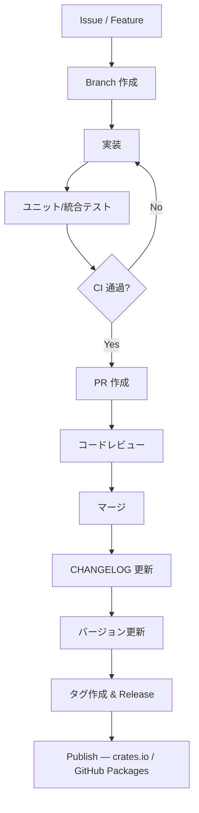
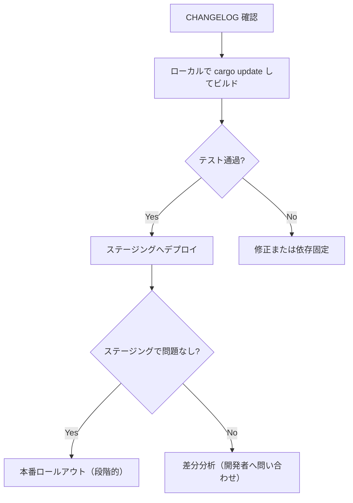

# service-framework 運用ガイド（簡潔版）

このドキュメントは `service-framework` をフレームワーク開発者と利用者の双方が安全に使えるように、運用・リリース・アップグレード手順を分かりやすく整理したものです。

対象読者:
- フレームワーク開発者（実装・リリース担当）
- フレームワーク利用者（サービス開発チーム）

前提:
- Rust Crate として実装されている（`Cargo.toml` がある）
- 公開先は crates.io または GitHub Packages
- セマンティックバージョニング（SemVer）を採用

---

## 要点サマリ
- 開発者は CI → テスト → CHANGELOG → バージョン更新 → 公開の順でリリースする。
- 利用者は CHANGELOG を確認してから段階的にアップデートする（ローカル→ステージング→本番）。
- 破壊的変更（Major）はマイグレーションガイドを必ず添付する。

---

## 開発者向け：リリース手順（短縮版）
目的: 安全にパッケージを公開し、利用者に影響を最小化する。

1. 変更の整理
   - イシューで変更内容と互換性影響（BREAKING CHANGE か否か）を明記する。
2. ブランチ戦略
   - `main` = リリース済み（安定）
   - 開発は `develop` または機能ブランチで行う
3. 実装 & テスト
   - ユニットテスト・統合テストを追加
   - 例: サンプルコードが動くことを確認
4. CI 実行（必須チェック）
   - ビルド: `cargo build --release`
   - テスト: `cargo test --all`
   - Lint: `cargo clippy --all-targets --all-features -- -D warnings`
   - フォーマット: `cargo fmt -- --check`
5. CHANGELOG とバージョン更新
   - 変更点・破壊的変更を明確に記載
   - `Cargo.toml` の version を SemVer に従って更新
6. パブリッシュ準備
   - パッケージ検査: `cargo package --allow-dirty`（Dry-run 確認）
7. 公開
   - crates.io または GitHub Packages に publish
   - GitHub Release を作成しタグと CHANGELOG を添付
8. リリース後の監視
   - 利用者の Issue をトリアージし、必要なら patch を即時リリース

開発者向けチェックリスト（最低限）:
- [ ] CI が全てパスしている
- [ ] テストカバレッジが主要パスをカバーしている
- [ ] CHANGELOG に BREAKING CHANGE が明示されている
- [ ] バージョンが SemVer に従っている
- [ ] GitHub Release とタグ作成済み
- [ ] Publish の成功確認

PowerShell での簡易チェック例:
```powershell
# 作業ツリーでの公開前チェック
cargo package --allow-dirty
cargo build --release; cargo test --all
cargo clippy --all-targets --all-features -- -D warnings
cargo fmt -- --check
```

---

## 利用者向け：導入と安全なアップグレード手順
目的: 既存サービスへの影響を最小限にして `service-framework` を導入/更新する。

導入（初回）:
1. README と examples を読む
2. `Cargo.toml` に依存を追加（最初は固定バージョン推奨）
   - 例: `service-framework = "0.4.2"`
3. ローカルでサンプルをビルド・実行して挙動を把握
4. CI に組み込む（build/test/clippy）

アップグレード（安全手順）:
1. リリースノート／CHANGELOG を読む
2. 互換性の分類を確認
   - PATCH: 直接更新可
   - MINOR: 後方互換なら段階導入
   - MAJOR: 破壊的変更 → マイグレーション計画必須
3. ローカルで依存を一時更新してビルド・テスト
   - `cargo update -p service-framework` または `Cargo.toml` 書き換え
4. ステージングへデプロイして動作確認
5. 問題なければ本番へ段階的ロールアウト

利用者向けチェックリスト:
- [ ] CHANGELOG を確認した
- [ ] ローカルビルドとテストが通る
- [ ] ステージングでの動作確認済み
- [ ] 破壊的変更がある場合はマイグレーションを実行

---

## バージョン管理ルール（SemVer の徹底）
- PATCH (x.y.Z): バグ修正のみ。後方互換を壊さない
- MINOR (x.Y.z): 後方互換を保った新機能追加
- MAJOR (X.y.z): 後方互換を壊す変更。ドキュメントとマイグレーション必須

推奨運用:
- 破壊的変更は 1 メジャー前から deprecate を記載
- 重大な依存更新は CHANGELOG に影響範囲を明示

---

## 破壊的変更（Major）の具体手順
1. 事前告知（README / CHANGELOG / Issue）
2. deprecate 期間を設ける（可能なら 1 マイナー〜1 メジャー分）
3. マイグレーションガイドを作成（サンプルコード付き）
4. リリース時に migration guide を必ず添付

---

## CI / 品質ゲート（テンプレート）
必須ジョブ:
- build: `cargo build --release`
- test: `cargo test --all`
- lint: `cargo clippy`
- format-check: `cargo fmt -- --check`
- package-dry-run: `cargo package --allow-dirty`

成功基準:
- 全ジョブが成功すること
- 重大な警告は CI で失敗にする（例: clippy の -D warnings）

---

## 役割と責務（要約）
- フレームワーク開発者: API 設計、実装、テスト、CHANGELOG、Migration Guide
- リリース担当: CI 管理、公開（crates.io / GitHub Packages）、タグ付け
- 利用者（サービス開発チーム）: 依存管理、ローカル・ステージングでの検証、本番ロールアウト

---

## 図（リリースフロー・アップグレードフロー）
### リリースフロー


### 利用者アップグレードフロー


---

## 要求事項対応チェックリスト（ドキュメント側）
- フレームワーク開発者目線の運用シナリオ: Done
- フレームワーク利用者目線の運用シナリオ: Done
- バージョン更新時の注意点を含める: Done
- マーメイドでのフロー図: Done

---

## 次のステップ（提案）
1. プロジェクト固有の公開先設定（crates.io のアカウント名や GitHub Packages の組織）をここに追記する
2. CHANGELOG テンプレートと Release テンプレートを `docs/` に追加する
3. マイグレーションガイドのテンプレートを作成する（Major リリース時に使用）

以上。必要ならさらに言葉を簡単にした版（より短いサマリ）や、CI 用の GitHub Actions テンプレートを作成します。

