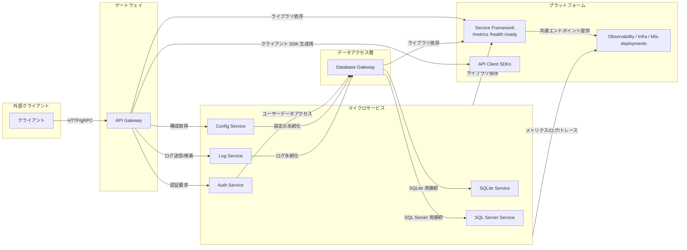

# サービス構成

---

## サービス一覧

---
このドキュメントはリポジトリ内のワークスペース（`services/`、`gateways/`、`framework/`、`platform/` など）をもとに、各サービスの責務と相互接続を整理したものです。

注: 本ドキュメントでは、各サービスおよびゲートウェイは共通フレームワークである `framework/service-framework` を利用することを前提としています。フレームワークは起動処理、設定読み込み、ログ、エラーハンドリング、メトリクス/ヘルスチェック (/metrics, /health, /ready) 等の共通機能を提供します。

以下はワークスペースに存在する主要なサービス群の一覧と概要です。リポジトリのディレクトリ構成に沿って網羅的に記載しています。

### サービス一覧

- services/auth-service
	- 役割: 認証・認可を担当するサービス（トークン発行、ユーザー認証、権限チェック）
	- 主な責務: ログイン、JWT発行/検証、ユーザー情報の取得
	- 想定データストア: ユーザー認証情報は外部のデータベース（database-gateway 経由）に保存
	- 実装ディレクトリ: `services/auth-service/src`
	- フレームワーク: `framework/service-framework` を利用することを前提とする

- services/config-service
	- 役割: アプリケーション設定（設定配信・取得）を提供
	- 主な責務: 構成値の管理、サービス設定のAPI提供
	- 実装ディレクトリ: `services/config-service/src`
	- フレームワーク: `framework/service-framework` を利用することを前提とする

- services/log-service
	- 役割: アプリケーションログの収集・保存・検索を行う
	- 主な責務: ログ受信API、ログの永続化、検索クエリのサポート
	- 実装ディレクトリ: `services/log-service/src`
	- フレームワーク: `framework/service-framework` を利用することを前提とする

- services/sqlite-service
	- 役割: SQLite を用いる小規模/組み込み用途のデータサービス
	- 主な責務: SQLite DB の操作を行う低レベルのデータアクセス或いはテスト用途
	- 実装ディレクトリ: `services/sqlite-service/src`
	- フレームワーク: `framework/service-framework` を利用することを前提とする

- services/sqlserver-service
	- 役割: SQL Server を利用するデータサービス
	- 主な責務: 本番相当の永続化レイヤ（リレーショナルデータ）の提供
	- 実装ディレクトリ: `services/sqlserver-service/src`
	- フレームワーク: `framework/service-framework` を利用することを前提とする

### ゲートウェイ

- gateways/api-gateway
	- 役割: 外部クライアントと内部サービス群のエントリポイント
	- 主な責務: ルーティング、認証/認可の入口、リクエストの集約・API 仕様の公開
	- 実装ディレクトリ: `gateways/api-gateway/src`
	- フレームワーク: `framework/service-framework` を利用することを前提とする

- gateways/database-gateway
	- 役割: 各サービスからのデータアクセスを抽象化し、DB への一貫したアクセス経路を提供
	- 主な責務: DB 接続管理、トランザクション制御、複数 DB 種（SQLite / SQL Server）へのルーティング
	- 実装ディレクトリ: `gateways/database-gateway/src`
	- フレームワーク: `framework/service-framework` を利用することを前提とする

### フレームワーク / 共通ライブラリ

- framework/service-framework
	- 役割: サービス共通のライブラリ（起動処理、設定読み込み、ログ、エラーハンドリング等）
	- 備考: 各サービスはこのフレームワークを利用して実装される想定
	- 実装ディレクトリ: `framework/service-framework/src`

	- 明記: 本リポジトリ内のサービス・ゲートウェイは基本的にこのフレームワークを取り込むことを前提としており、共通のエンドポイント（/metrics, /health, /ready）や設定・起動フローをフレームワーク側で提供します。

### プラットフォーム / その他

- platform/api-client-sdks
	- 役割: 外部利用者向けのクライアント SDK を生成・管理するためのディレクトリ
	- 備考: API 仕様に基づく SDK 生成やサンプルクライアントを置く

- observability / infra / k8s-deployments など
	- 役割: 監視、インフラ構成、Kubernetes マニフェストなどの定義を格納
	- 備考: 本リポジトリでは `platform/` 以下に関連ドキュメントを配置

## 相互接続とデータフロー（マーメイド図）

以下はサービス間の高レベルな接続図です。実際の通信プロトコルやポート番号はサービス実装やデプロイ設定に依存しますが、相互関係の把握を目的としています。

- Database Gateway を通して DB 操作を一元化することで、サービス側の DB 依存を抽象化する。
- observability 用のエンドポイント（/metrics, /health, /ready）を各サービスで提供し、監視基盤に接続すること。
- 開発時は `sqlite-service` を使ったローカル実行、ステージ/本番では `sqlserver-service` を使う運用が想定される。

---

このファイルはリポジトリ内の現状ディレクトリを基に作成しています。追加の要望（各サービスの詳細な API リスト、ポート/環境変数、Kubernetes マニフェストの紐付けなど）があれば続けて実装します。

---