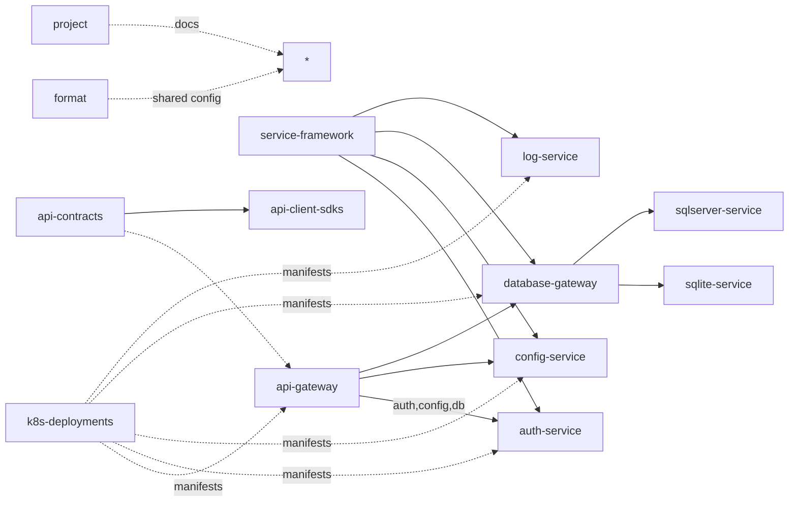

# リポジトリ構成

## 目的
このドキュメントは、本リポジトリのトップレベル構成、開発・運用上の最低限の規約、ビルド／実行方法の参照を示します。

> 注: 各サービス内のフォルダやファイルの詳細な説明はここでは省略します。

## 範囲
- 本リポジトリに含まれるトップレベルのディレクトリとその役割（簡潔に）
- 開発時の基本的なワークフロー、命名規約、ビルド／実行コマンド

## テーマ

マイクロサービス

## トップレベル構成（一覧）
- `api-client-sdks` — 各サービスのクライアント SDK（自動生成された SDK やサンプルクライアント）
- `api-contracts` — API 契約（OpenAPI やスキーマ、契約テスト、共通の API 定義）
- `api-gateway` — 外部クライアント向けのエントリポイント（ルーティング、認証、リクエスト集約）
- `auth-service` — 認証・認可を担当するサービス（トークン発行、ユーザ管理など）
- `config-service` — アプリケーション設定の管理・配信サービス
- `database-gateway` — データベースアクセスの抽象化・仲介（共通クエリ、接続管理）
- `log-service` — ログの集約・保管・検索を担うサービス
- `sqlite-service` — SQLite を使った軽量ストレージ向けサービス
- `sqlserver-service` — Microsoft SQL Server 向けのサービス実装
- `service-framework` — サービス共通のランタイム、ライブラリ、ユーティリティをまとめたフレームワーク的リポジトリ
- `format` — 共有のフォーマット設定や整形ルール（コード整形設定等）
- `project` — ドキュメント、仕様、運用手順などの非コード資産を格納するディレクトリ
- `ci-templates` — CI/CD ワークフローをまとめたリポジトリ（再利用可能なパイプライン定義）
- `k8s-deployments` — Kubernetes 用デプロイメントマニフェストや環境固有のデプロイ設定を格納するリポジトリ

## リポジトリ相関図
※マーメイドで記載すること

